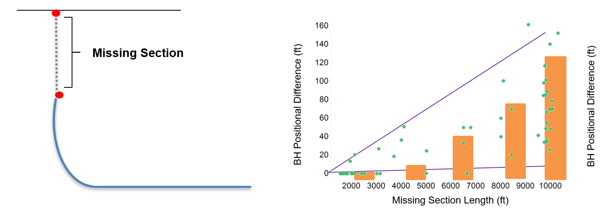

# alankylam.github.io
# Data Science Portfolio by Alan Lam

This portfolio is a compilation of projects I created for corporate data analysis and undergraduate courses. 

## Petroleum Company Drilling Data Project 
### Problem

This project tackled the data integrity issue that caused major discrepancies between theoretical and actual oil well data. 

There were major differences in the software calculated and field captured bottom-holes (BH), the deepest known point of a well, within the corporate repository of over 19,000 wells. 

> Well Schematic for a Horizontal Well

> 3D Visualization of Bottom Hole Discrepancy  

### Analysis
First, we must understand how drilling data is recorded and visualized. 

Drilling data is collected through measurement-while-drilling (MWD) tools during the drilling process that utilizes electrical impulses to transmit a combination of data. The survey data collected typically consists of measured depth, inclination, and azimuth--or MDINCAZM for short. 

> Data Acquisition with MWD tools while drilling  

The MDINCAZM data is then visualized using the mathematical formula called the minimum curvature method displayed below.

> Minimum Curvature Method   

With this in mind, my analysis first focused on the different parameters of the well to understand which part of had the largest impact.

**Parameters of an Oil Well**
* Vertical  
* Build 
* Lateral
* Azimuth (Cardinal Directions)  

> Vertical Section   

> Build Section   

> Lateral Section   

> Azimuth (Well Orientation)   

The conclusion from this analysis found that the vertical length was the major culprit. The vertical section of the data set was left out for operational cost cutbacks by decreasing the use of the MWD tool. But, in return, caused data integrity issues back in the office. 

I conducted further analysis on the missing vertical lengths to understand on what magnitude this impacted the BH discrepancy. 

> Missing Vertical Section Analysis  

I saw that a larger missing vertical data set for a well did not **directly** lead to a larger discrepancy, but rather, a larger **potential** for error.
> For example: 2 oil wells, each with 2000 ft missing vertical length. You would first assume they would have similar BH errors, but they didn't. One had an error of 150 ft, the other only had an error of 2 ft! Weird! 

To take my analysis further, I was then able to create a heatmap that highlighted BH errors alongside well parameters to further understand this discrepancy. 

### Solution
Next, I began testing for different solutions to minimize the BH difference. 

I began interpolating the missing well data to fill in the data gaps for various wells. After defining interpolation rules, I was able to minimize the BH discrepancy by ~70% (e.g. 50ft BH error to 15ft error).

[insert fixed data sheet] [insert data results]

I was then able to create a Python script to streamline this process for the corporate repository. 

[corporate repository before/after]
