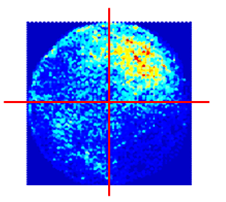

### [alankylam.github.io](alankylam.github.io)
## Data Science Portfolio by Alan Lam

This portfolio is a compilation of projects I created for corporate data analysis and undergraduate courses. 


**My Projects:**
1. [Oil & Gas Corporate Drilling Data Project](https://alankylam.github.io/#oil--gas-corporate-drilling-data-project---sql-vba-python-spotfire)
2. [Reservoir Simulation Model Project](https://alankylam.github.io/#reservoir-simulation-model-project---python-vtk-matplotlib-numpy)
3. [Los Angeles Investment Projections](https://alankylam.github.io/#los-angeles-investment-projections---r-tableau-sql)

## Oil & Gas Corporate Drilling Data Project - SQL, VBA, Python, Spotfire

### Outline
* [Problem](https://alankylam.github.io/#problem)
* [Analysis](https://alankylam.github.io/#analysis)
* [Solution](https://alankylam.github.io/#solution)

### Problem

This project tackled the data integrity issue that caused major discrepancies between theoretical and actual oil well data. 

There were major differences in the software calculated and field captured bottom-holes (BH), the deepest known point of a well, within the corporate repository of over 19,000 wells. 


> Well Schematic for a Horizontal Well


> 3D Visualization of Bottom Hole Discrepancy  


### Analysis
First, we must understand how drilling data is recorded and visualized. 

Drilling data is collected through measurement-while-drilling (MWD) tools during the drilling process that utilizes electrical impulses to transmit a combination of data. The survey data collected typically consists of measured depth, inclination, and azimuth--or MDINCAZM for short. 


> Data Acquisition with MWD tools while drilling  


The MDINCAZM data is then visualized using the mathematical formula called the minimum curvature method displayed below.


> Minimum Curvature Method   


With this in mind, my analysis first focused on the premise that certain sections of the well were most prone to errors.

**Parameters of an Oil Well**
* Vertical  
* Build 
* Lateral
* Azimuth (Cardinal Directions)  


> Vertical Section   


> Build Section   


> Lateral Section   


> Azimuth (Well Orientation)   


The conclusion from this analysis found that the vertical length was the major culprit. The vertical section of the data set was left out for operational cost cutbacks by decreasing the use of the MWD tool. But, in return, caused data integrity issues back in the office. 

I conducted further analysis on the missing vertical lengths to understand on what magnitude this impacted the BH discrepancy. 


> Missing Vertical Section Analysis  

I saw that a larger missing vertical data set for a well did not **directly** lead to a larger discrepancy, but rather, a larger **potential** for error.
> For example: 2 oil wells, each with 2000 ft missing vertical length. You would first assume they would have similar BH errors, but they didn't. One had an error of 150 ft, the other only had an error of 2 ft! Weird! 

To take my analysis further, I was then able to create a heatmap that highlighted BH errors with different combinations of well parameters to further understand explore the issue. 





> Heatmap further analyzing Missing Vertical Length parameter along with other various parameters

### Solution
Next, I began testing for different solutions to minimize the BH difference. 

I began interpolating the missing well data to fill in the data gaps for various wells. After defining interpolation rules, I was able to minimize the BH discrepancy by ~70% (e.g. 50ft BH error to 15ft error).


I was then able to create a Python script to streamline this process for the corporate repository. 

```
Python Script:

Unfortunately, the initial code built is proprietary and not shareable. I will update with framework soon.
```


## Reservoir Simulation Model Project - Python, VTK, Matplotlib, NumPy

### Outline
* [Define Reservoir Characteristics](https://alankylam.github.io/#define-reservoir-characteristics)
* [Build Reservoir](https://alankylam.github.io/#build-reservoir)
* [Simulate Production](https://alankylam.github.io/#simulate-production)

### Objective
Reservoir simulation is used to predict the flow of fluids (typically, oil, water, and gas) through a porous media. With a reservoir, we can understand flow and transport in our reservoirs to make engineering decisions.


> Typical oil & gas reservoir 

### Define Reservoir Characteristics
First, we must define the reservoir characteristics such as transmissibility, porosity, permeability, fluid viscosity, and rate of change within a 1D reservoir. 

```
class OneDimReservoir():
    
    def __init__(self, inputs):
        '''
            Class for solving one-dimensional reservoir problems with
            finite differences.
        '''
        
        #stores input dictionary as class attribute
        self.inputs = inputs
        
        #computes delta_x
        #self.delta_x = self.inputs['reservoir']['length'] / float(self.inputs['numerical']['number of grids'])
        
        #gets delta_t from inputs
        self.delta_t = self.inputs['numerical']['time step']
        
        self.list_inputs()
        
        #calls fill matrix method (must be completely implemented to work)
        self.fill_matrices()
        
        #applies the initial reservoir pressues to self.p
        self.apply_initial_conditions()
        
        #create an empty list for storing data if plots are requested
        if 'plots' in self.inputs:
            self.p_plot = []
            
        return
    
    def list_inputs(self):
        '''
            Store inputs for the function
        '''
        
        self.Vis = self.inputs['fluid']['viscosity']
        self.Bo = self.inputs['fluid']['formation volume factor']
        self.N = self.inputs['numerical']['number of grids']
        self.length = self.inputs['reservoir']['length']
        self.Co = self.inputs['fluid']['compressibility']
        
        if 'conversion factor' in self.inputs:
            self.C_fac = self.inputs['conversion factor']
            
        else:
            self.C_fac = 1
                
        # k A and porosity
        phi = self.inputs['reservoir']['porosity']
        perm = self.inputs['reservoir']['permeability']
        area = self.inputs['reservoir']['cross sectional area']
        
        self.phi = self.input_and_return_data(phi)
        self.perm = self.input_and_return_data(perm)
        self.area = self.input_and_return_data(area)
        # put if conversion factor to make generic code
        
        self.delta_x = self.assign_delta_x_array()
        
    def assign_delta_x_array(self):
        
        if 'delta x' not in self.inputs['numerical']:
            length = self.inputs['reservoir']['length']
            delta_x = np.float(length)/self.N
            delta_x_arr = np.ones(self.N) * delta_x
            
        else:
            delta_x_arr = np.array(self.inputs['numerical']['delta x'],dtype=np.double)
            length_delta_x_arr = delta_x_arr.shape[0]
            
        return delta_x_arr
            
            #assert length_delta_x_arr == self.N,(" User defined delta x does not match with number of grids ")
    
    def input_and_return_data(self,input_data):
        '''
            To check the input a tuple or a single value
        '''
        
        # Start Here
        # use isinstance
        if isinstance(input_data,(list,tuple)):
            output = input_data
        else:
            output = input_data* np.ones(self.N)
        return output
            
        
    def compute_transmissibility(self,i,j):
        '''
            Computes the transmissibility.
        '''
        # Complete implementation here
        # in this case i+1 = j
        k = self.perm
        a = self.area
        delta_x = self.delta_x
        
        #volume = (self.area*self.length)/self.N
        #return self.perm * self.area / (self.Vis * self.Bo * (volume/self.area)) 
        
        constant = 1/(self.Bo*self.Vis)
        constant2 = (2*k[i]*a[i]*k[j]*a[j])/((k[i]*a[i]*delta_x[j])+(k[j]*a[j]*delta_x[i]))
        return constant * constant2
    
    
    def compute_accumulation(self,i):
        '''
            Computes the accumulation.
        '''
        
        # Complete implementation here
        
        #volume = ((self.area * self.length) / self.N)
        #return ((volume * self.phi * self.Co) / self.Bo)
        
        # Function
        
        k = self.perm
        a = self.area
        phi= self.phi
        delta_x = self.delta_x
        
        return a[i]*delta_x[i]*phi[i]*self.Co/self.Bo
        
    def apply_initial_conditions(self):
        '''
            Applies initial pressures to self.p
        '''
        
        N = self.inputs['numerical']['number of grids']
        
        self.p = np.ones(N) * self.inputs['initial conditions']['pressure']
        
        return
        

```

> 2D Reservoir Model created through Matplotlib

### Build Reservoir 
Next, the reservoir can now be built in 2D  with Matplotlib and then transformed into 3D using VTK matrices.


```
class TwoDimReservoir(OneDimReservoir):
    
    def __init__(self, inputs):
        '''
            Class for solving one-dimensional reservoir problems with
            finite differences.
        '''
        
        #stores input dictionary as class attribute
        if isinstance(inputs, str):
            with open(inputs) as f:
                self.inputs = yaml.load(f)
        else:
            self.inputs = inputs
        
        #assigns class attributes from input data
        self.parse_inputs()
        
        #calls fill matrix method (must be completely implemented to work)
        self.fill_matrices()
        
        #applies the initial reservoir pressues to self.p
        self.apply_initial_conditions()
        
        #create an empty list for storing data if plots are requested
        if 'plots' in self.inputs:
            self.p_plot = []
            
        return
    
    def parse_inputs(self):
        
        self.Vis = self.inputs['fluid']['viscosity']
        self.Bo = self.inputs['fluid']['formation volume factor']
        self.Nx = self.inputs['numerical']['number of grids']['x']
        self.Ny = self.inputs['numerical']['number of grids']['y']
        self.length = self.inputs['reservoir']['length']
        self.Co = self.inputs['fluid']['compressibility']
        self.N = self.Nx*self.Ny
    
        if 'conversion factor' in self.inputs:
            self.C_fac = self.inputs['conversion factor']
            
        else:
            self.C_fac = 1
                
        # k A and porosity
        phi = self.inputs['reservoir']['porosity']
        perm = self.inputs['reservoir']['permeability']
        #area = self.inputs['reservoir']['cross sectional area']
        depth = self.inputs['reservoir']['depth']
        
        self.phi = self.input_and_return_data(phi)
        self.perm = self.input_and_return_data(perm)
        #self.area = self.input_and_return_data(area)
        self.depth = self.input_and_return_data(depth)
        # put if conversion factor to make generic code
        
        self.delta_x = self.assign_delta_x_array()
        self.delta_y = self.assign_delta_y_array()
        
    def assign_delta_x_array(self):
        
        if 'delta x' not in self.inputs['numerical']:
            length = self.inputs['reservoir']['length']
            delta_x = np.float(length)/self.Nx
            delta_x_arr = np.ones(self.N) * delta_x
            
        else:
            delta_x_arr = np.array(self.inputs['numerical']['delta x'],dtype=np.double)
            length_delta_x_arr = delta_x_arr.shape[0]
            
        return delta_x_arr
            
            #assert length_delta_x_arr == self.N,(" User defined delta x does not match with number of grids ")
    
    def assign_delta_y_array(self):
        
        if 'delta y' not in self.inputs['numerical']:
            height = self.inputs['reservoir']['height']
            delta_y = np.float(height)/self.Ny
            delta_y_arr = np.ones(self.N) * delta_y
            
        else:
            delta_y_arr = np.array(self.inputs['numerical']['delta y'],dtype=np.double)
            length_delta_y_arr = delta_y_arr.shape[0]
            
        return delta_y_arr
            
            #assert length_delta_x_arr == self.N,(" User defined delta x does not match with number of grids ")
            
    def fill_matrices(self):
        '''
            Fills the matrices A, I, and \vec{p}_B and applies boundary
            conditions.
        '''
        
        N = self.inputs['numerical']['number of grids']
        
        self.p = np.ones(N) * self.inputs['initial conditions']['pressure']
        
        # T and B matrix
        # T is A matrix multiply by transmissibility
        # B is I matrix multiply by accumulation
        #Complete implementation here
        
        Q = np.zeros(N)
        C = self.C_fac
        
        #Start here
    
        # B matrix
        I = scipy.sparse.identity(N,format='csc')
        for i in range(0,N):
            I[i,i] = self.compute_accumulation(i)
           
        V = N
        T = lil_matrix((N,N))

        for i in range(0,N):
            if i == 0:
                if self.inputs['boundary conditions']['left']['type'] == 'prescribed pressure':
                    T[i,i] = (2*self.compute_transmissibility(i,i) + self.compute_transmissibility(i,i+1))*C
                    T[i,i+1] = -self.compute_transmissibility(i,i+1)*C
                    Q[i] = 2*self.compute_transmissibility(i,i)*C*self.inputs['boundary conditions']['left']['value']
                else:
                    T[i,i] = (0 + self.compute_transmissibility(i,i+1))*C
                    T[i,i+1] = -self.compute_transmissibility(i,i+1)*C
                    Q[i] = 0
            elif i == N-1:
                if self.inputs['boundary conditions']['right']['type'] == 'prescribed pressure':
                    T[i,i] = (2*self.compute_transmissibility(i,i) + self.compute_transmissibility(i,i-1))*C
                    T[i,i-1] = -self.compute_transmissibility(i,i-1)*C
                    Q[i] = 2*self.compute_transmissibility(i,i)*C*self.inputs['boundary conditions']['right']['value']
                else:
                    T[i,i] = (0 + self.compute_transmissibility(i,i-1))*C
                    T[i,i-1] = -self.compute_transmissibility(i,i-1)*C
                    Q[i] = 0
            else:
                T[i,i] = (self.compute_transmissibility(i,i-1)+self.compute_transmissibility(i,i+1))*C
                T[i,i-1] = -self.compute_transmissibility(i,i-1)*C
                T[i,i+1] = -self.compute_transmissibility(i,i+1)*C

    
        # A , I , Pb completed
        self.B = I
        self.T = T.tocsr()
        self.Q = Q
        
        return
        
      import matplotlib.pyplot as plt
        fig = plt.figure()
        ax = fig.add.axes([0.1, 0.1, 0.8, 0.8], polar=True)
        r = numpy.arrange(0, 3.0, 0.01)
        theta =2*numpy.pi*r
        ax.set_rmax(2.0)
        ax.grid(True)
        
        plt.show()
        
class ThreeDimReservoir(TwoDimReservoir):
        vtk_pts = array2vtkpoints(matrix)
        
        grid = vtk.vtkUnstructuredGrid()
        grid.setpoints(vtk_pts) 
        
        ids = numpy.arrange(0, 8*nx*ny*nz, 8)
        cells = array2vtkCellArray(ids)

        ungrid = vtkExtractUnstructuredGrid()
        ungrid.setinput(grid)
        
        ungrid = ungrid.GetOutput()
        ungrid.Update()
 ```
 

### Simulate Production
Finally, we can create hypothetical oil wells that produce into the reservoir over a period of time. We can now observe and monitor the expected production and drainage of this reservoir. 

```
import os
import numpy as np

from project2 import Project2

def secret_project2_test_1(BHP=float(os.environ['BHP1'])):
    
    test = Project2('inputs.yml')
    
    test.inputs['wells']['bhp']['values'] = [BHP, BHP, BHP, BHP]
    
    test.parse_inputs()
    
    test.fill_matrices()
    
    test.solve_one_step()
    
    np.testing.assert_allclose(test.get_solution()[605:609], 
                               np.array([ 3309.0,  3287.8,  3262.7,  3237.4]),
                               atol=0.5)
    
    return

def secret_project2_test_2(BHP=float(os.environ['BHP2'])):
    
    test = Project2('inputs.yml')
    
    test.inputs['wells']['bhp']['values'] = [BHP, BHP, BHP, BHP]
    
    test.parse_inputs()
    
    test.fill_matrices()
    
    test.solve()
    
    np.testing.assert_allclose(test.get_solution()[500:508], 
                               np.array([ 2228.2,  2228.2,  2228.1,  2228.0,
                                          2228.0,  2227.9,  2227.9,  2227.9]),
                               atol=0.1)
    
    return 
 ```


> Final Product of Reservoir Model created through VTK

## Los Angeles Investment Projections - R, Tableau, SQL

Under Construction
